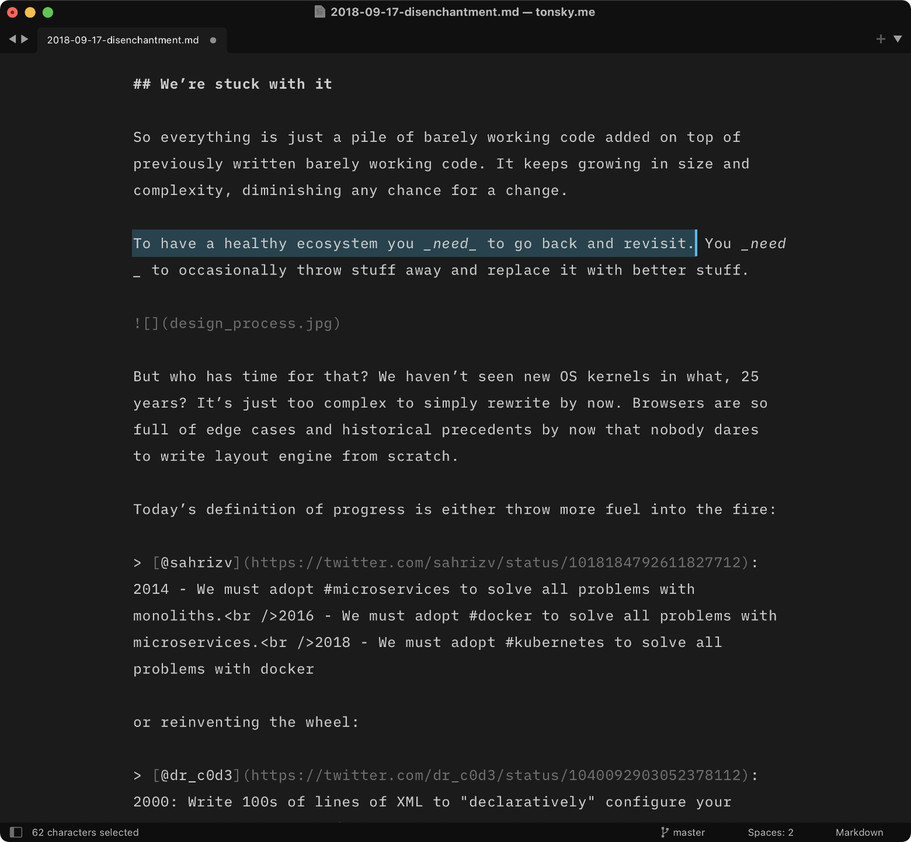

# Writer Color Scheme for Sublime Text

A color scheme for focused long-form writing, mimicking fantastic [iA Writer](https://ia.net/writer).

- Monochromatic color scheme for less distraction.
- Optimized for Markdown.
- Light and Dark versions.
- Pairs well with [iA Writer Mono](https://github.com/iaolo/iA-Fonts/tree/master/iA%20Writer%20Mono/Static) at 16 px.

## Screenshots

## Installation

First, install Writer via Package Control:

1. `Tools` → `Command Palette...` → `Package Control: Install Package`
2. Select `Writer Color Scheme` and press Enter.

Then, enable it:

3. Select `Preferences → Color Scheme ...`
4. Pick `Auto`, then `Writer` for light variant and `Writer Dark` for dark variant.

## See also

[Alabaster Color Scheme](https://github.com/tonsky/sublime-scheme-alabaster): minimal color scheme for coding.

[Profile Switcher](https://github.com/tonsky/sublime-profiles): Switch quickly between writing and coding profiles.

[Fira Code](https://github.com/tonsky/FiraCode/): Best coding font in the world.

## Credits

Made by [Niki Tonsky](https://twitter.com/nikitonsky).

## License

[MIT License](./LICENSE.txt)